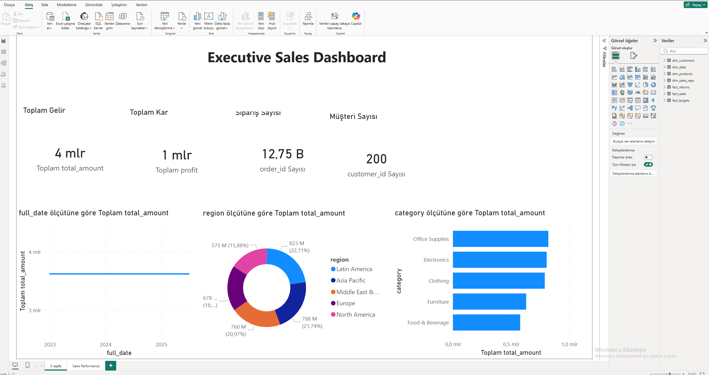
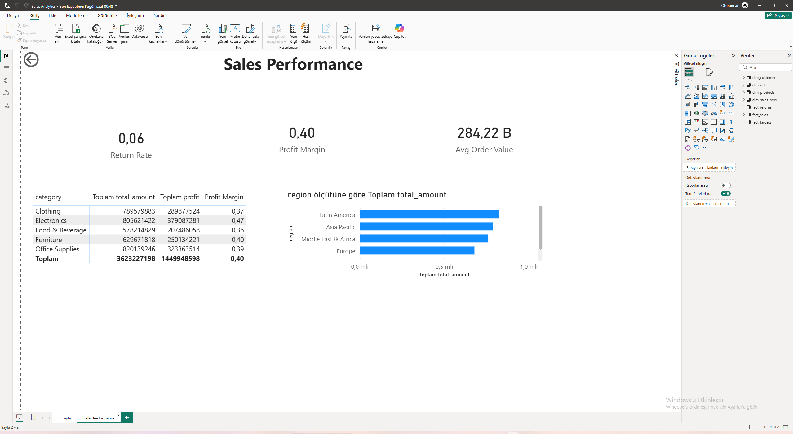

# Power BI - Enterprise Sales Analytics Dashboard

## Overview

A comprehensive sales analytics solution built with Power BI, demonstrating enterprise-grade data modeling, DAX calculations, and security configurations.

## Features

- **Star Schema Data Model** with 3 fact tables and 4 dimension tables
- **50+ DAX Measures** including time intelligence, KPIs, and dynamic calculations
- **Row-Level Security (RLS)** with both static and dynamic implementations
- **Object-Level Security (OLS)** restricting cost/profit visibility by role
- **6 Dashboard Pages**: Executive Summary, Sales Performance, Customer Analytics, Product Deep Dive, Regional Analysis, Drill-Through Detail
- **Drill-Through Navigation** for order-level detail exploration
- **Bookmark-based Theme Toggle** (Dark/Light mode)

## Dashboard Pages

### Executive Summary


### Sales Performance


## Data Model

See [data_model.md](data-model/data_model.md) for complete documentation.

## DAX Measures

All measures are organized in [dax-measures/](dax-measures/) directory:

| File | Description |
|------|-------------|
| `sales_measures.dax` | Revenue, profit, time intelligence, customer & product analytics |

### Key Measure Examples

```dax
Revenue YoY Growth = 
VAR CurrentYear = [Total Revenue]
VAR PreviousYear = [Revenue Previous Year]
RETURN
DIVIDE(CurrentYear - PreviousYear, PreviousYear, 0)
```

## Power Query (M) Transformations

Pre-built transformation scripts in [power-query/](power-query/) directory:

| File | Purpose |
|------|---------|
| `dim_customers.pq` | Trim, proper case, dedup, add Region Sort column |
| `dim_products.pq` | Type casting, profit margin calc, price tier classification |
| `dim_date.pq` | Date/fiscal calendar enrichment, month/day sort columns, holiday flag |
| `fact_sales.pq` | Validation, shipping days calc, discount tier bucketing |
| `fact_returns.pq` | Return category classification (Quality / Shipping / Customer Decision) |

All queries rename raw column headers to user-friendly display names (e.g., `total_amount` → `Total Amount`).

## How to Use

1. Open Power BI Desktop
2. Get Data → CSV → Load all files from `data/` folder
3. Apply Power Query transformations from `power-query/` for proper formatting
4. Configure relationships as defined in `data_model.md`
5. Copy DAX measures from `dax-measures/` into your model
6. Set up RLS roles as defined in `rls_setup.dax`
7. Build report pages following the layout described in documentation

## Security Configuration

See [rls_setup.dax](data-model/rls_setup.dax) for complete RLS/OLS implementation guide.
